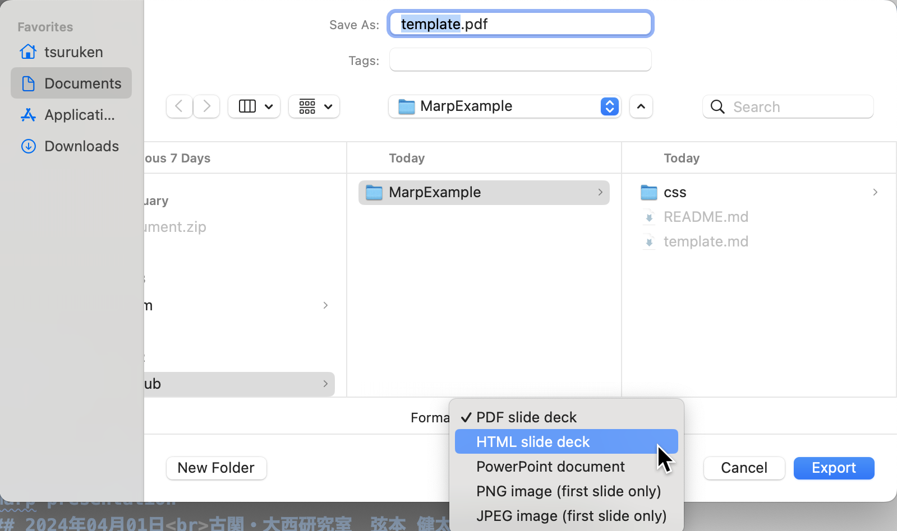

# Marp Example Files for intuitive slide making
このレポジトリには，[Marp](https://marp.app/) (Markdown Presentation Ecosystem)を用いた直感的で美しいスライド作りをするためのテンプレを置いてあります。

## 事前準備
1. Visual Studio Codeのダウンロード（以降VSCodeでの環境構築を前提に話を進めます）
2. VS Codeを開き，拡張機能からMarp for VS Codeをインストール
3. VS Codeの`settings.json`を開き以下を追加
```
"markdown.marp.themes": ["./css/slide.css"],
"markdown.marp.enableHtml": true
```
（`settings.json`はショートカットキー`Ctrl + Shift + P` (Macなら`Cmd + Shift + P`)でコマンドパレットを表示してから`settings`と入力することで選択できる。）

## スライドを作り始める
1. `template.md`と`css`フォルダをコピーして任意のWorkingディレクトリに置く
	- `css`フォルダは中身を丸ごとコピーする
	- `template.md`と`css`フォルダは同じ階層に置く
	- `template.md`は任意に改名可能
2. `template.md`の中身を編集してスライド作成！
	- `.pdf`, `.html`, `.pptx`にExport可能（後述）

## スライドのExport方法
1. テキストウィンドウ右上のMarpボタンをクリック


2. `Export Slide Deck...`を選択


3. 保存形式から任意のもの（.pdf, .html, .pptx）を選択

