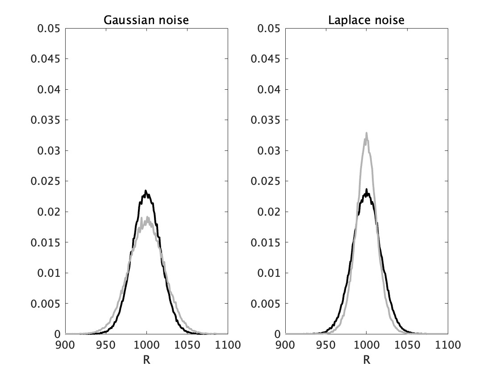
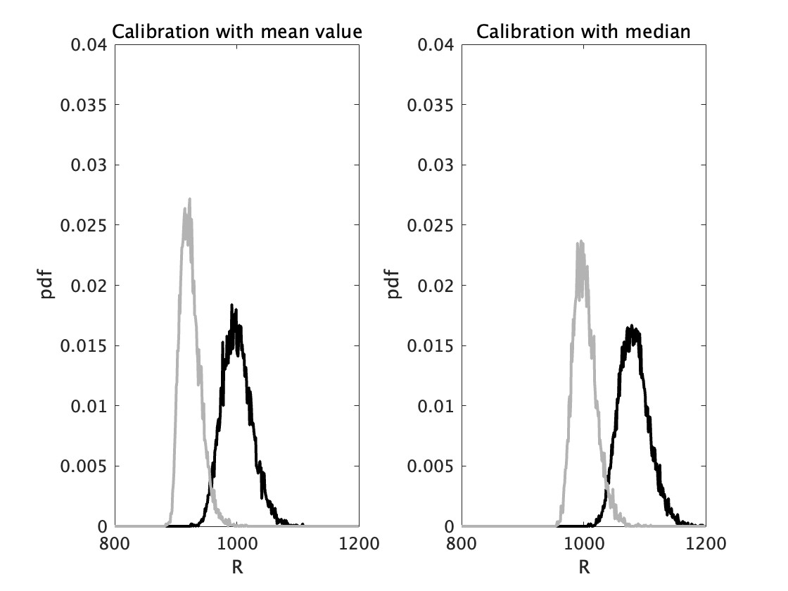
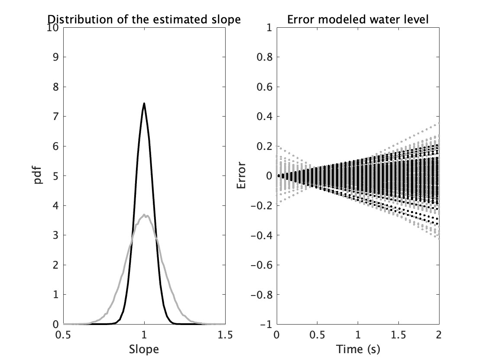
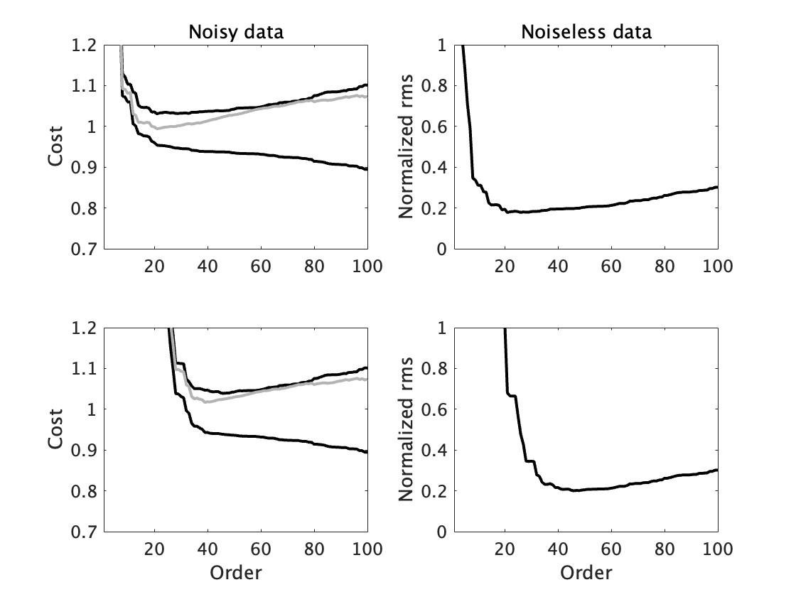
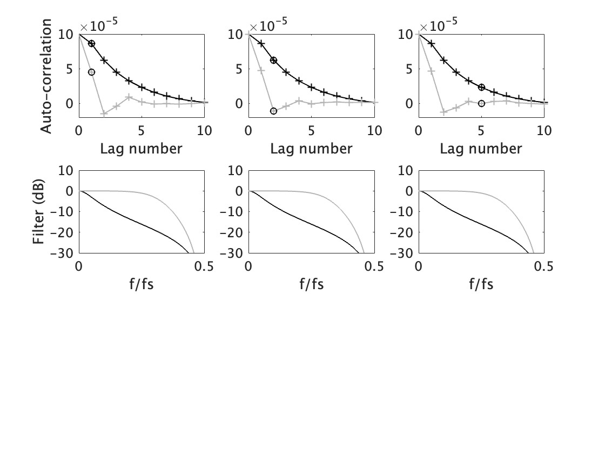
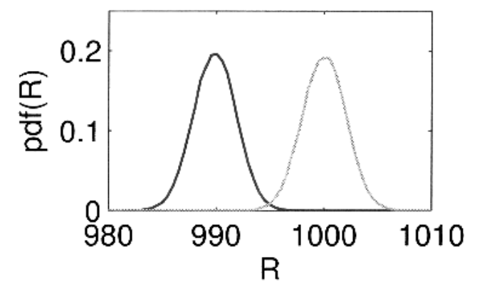

<!-- <style>section{font-family:'Noto Sans CJK JP'}</style> -->
<!-- 東大公式推奨のフォント
https://fonts.google.com/noto/specimen/Noto+Sans+JP
からダウンロード -->
<style>section{font-family:'IPAexGothic'}</style>
<!-- Ipeとの互換性をとりたい場合
https://moji.or.jp/ipafont/ipafontdownload/
からダウンロード -->

<!-- 
_paginate: skip 
_class: title 
-->


# **古関大西研究室 輪読合宿**

## **MSI100 chap.1.3-1.6**


### 2024.5.12
### B4 仲野 太智
### *Taichi Nakano*

----
# About Me

### 古関・大西研究室 
## B4 仲野太智


Working On: 五月祭 - 電子工作教室

研究テーマ: 直流遮断(明後日から実験です)


----
# The First Difficult Point Sys-Id

"Real world **never** goes as we imagine!" 

=> But we need to fight against real data 

___

# The First Difficult Point Sys-Id

"Real world **never** goes as we imagine!" 

=> But we need to fight against real data 

# In this plesentation, we will learn...
How to Solve the Problem of **DISTURBANCE**.


---
# 目次 (簡単要約)

### ↓各種推定の導入
## 1.3 ガウス分布とラプラス分布の最尤推定

###  ↓測定時に起きうる測定ノイズとその処理
## 1.4 外れ値があるノイズの処理
## 1.5 モデリングのバイアスとバリアンス
## 1.6 入出力ノイズの測定従属変数法と変数内誤差法(一部)
---
#### 1.3 MAXIMUM LIKELIHOOD ESTIMATION 
#### FOR GAUSSIAN AND LAPLACE DISTRIBUTED NOISE

ガウス、ラプラスノイズに対する最尤推定
### 最大尤度フード理論*:
各分布には適切な評価関数がある。 
* ガウス分布 → 最小二乗法(LS: Least Square)　
	$min V_{LS(R)} =\Sigma_{1}^{N}(u_{(t)}-Ri_{(t)})^2$

* ラプラス分布 → 最小絶対値(LAV: Least Absolute Values)
	$min V_{LAV(R)}= \Sigma_{1}^{N}|u_{(t)}-Ri_{(t)}|$
---
### 1.3 ガウス、ラプラスノイズに対する最尤推定
#### Ex.8 Dependence of a cost function on a distributions of the noise
最適なコスト関数の外乱ノイズの分布への依存

例:抵抗値の測定(オームの法則)

<div class="columns" style="--col_number: 2;">
<div>
理想:

* ${u_0} _{(t)}= R_0 {I_0}_{(t)}$ 
 
観測:(この場合は、u観測に等しい。)

* $u_{(t)} = {u_0} _{(t)}+ {n_u}_{(t)}$ (電流は正確とする)

</div>
<div>
* ${n_u}_{(t)}$に、1.ガウス 2.ラプラス　ノイズを入れた際、LS,LAVを用いて、$u$ を推定すると?


$R_0=1000$Ω
ノイズ平均 $\mu=0$, 
ガウス、ラプラスともに分散$σ^2= 1$

</div>

---
### 1.3 Ex.8 最適なコスト関数の外乱ノイズの分布への依存


<div class="columns" style="--col_number: 2;">
<div>
結果:

 Ex.8 right:Gausu, left: Laplase
　black: LS, gray: LS

|  | $\hat{\mu}_{LS}$ | $\hat{\sigma}_{LS}$| $\hat{\mu}_{LAV}$ | $\hat{\sigma}_{LAV}$ |
| :---: | :---: | :---: |:---: |:---: |
|GAU|999.9|17.3|1000|21.7|
|LAP |999.8 |17.3|999.9|13.6 |

</div>
<div>

* 分散に注目(小さい方が確かさが良い)すると
ガウス分布には最小二乗法、ラプラス分布には最小絶対値法が良い。

* imp. 分布ごとに最適な評価関数が決まっているが、**分散が有限とわかっている時**最小二乗法が無難である。

</div>


---
#### 1.4 IDENTIFICATION FOR SKEW DISTRIBUTIONS WITH OUTLIERS
外れ値を持つ分布に対する同定

### Ex.9 Identification in the presence of outliers


Ex.8の抵抗観測 $R_0=1000$Ω:
* $u_{(t)} = {u_0} _{(t)}+ {n_u}_{(t)}$ (電流は正確とする)

$n_u$に$\chi^2$分布(2乗正規分布,極端な値を持ちやすい)(分散$\sigma_{u}^2=1$)を適用する。

上記の極端な値を補正:
* 平均値、中央値をそれぞれ引き、LS LAVの推定をする(4パターン)。

---
#### 1.4 Ex.9 外れ値を持つ分布に対する同定
<div class="columns" style="--col_number: 2;">
<div>
結果:

 Ex.9 right:mean, left: median
　black: LS, gray: LS

|  | $\hat{\mu}_{LS}$ | $\hat{\sigma}_{LS}$| $\hat{\mu}_{LAV}$ | $\hat{\sigma}_{LAV}$ |
| :---: | :---: | :---: |:---: |:---: |
|mean|1000|24.57|924.3|16.52|
|median|1082 |24.76|1002 |18.87|

</div>
<div>
推定平均を比較すると、外れ値がある時、推定方法に対する適切な補正の仕方がある。
* LS推定
	* 平均値で補正する

* LAV推定 
	* 絶対値で補正する

</div>


---
#### 1.5 SELECTION OF THE MODEL COMPLEXITY

* 今まで何気なく出してきた前提の式はどこから?? 

	* システムのモデリングの必要性
	(あくまで物理モデル等が決定できないときの話(とする))

	===> Section2以降につながる。

----
#### 1.5 SELECTION OF THE MODEL COMPLEXITY
#### 1.5.1 Ex.10 Influence of the number of parameters on  uncertainty

$y_{(t)}=a_0+n_{(t)}$
$a_0=1,n_t\sim N(0,σ_n^2)$ 
\
に対し、簡単な2つのモデル
	1. $y=at$ 
	2. $y=at+b$
をフィッティングする。

平均、標準偏差で判別。

---
### 1.5.1
#### Ex.10 パラメータ数と推定の不確定さ
<div class="columns" style="--col_number: 2;">
<div>
結果:

 Ex.10 
black: 1Parameter, gray: 2Parameter
right:pdf, left: Error(ズレ)


</div>


<div>

|  | 1Parameter | 2Parameter| 
| :---: | :---: | :---: |
|mean|0.9998|1.0001|
|std.d|0.0547| 0.1091|

パラメータが1つの時の方が、標準偏差がはるかに小さい上に、エラーが大きい。
* 1パラメータでは、不確かさが低くなる。
</div>


---
### 1.5 モデリングのバイアスとバリアンス 
### 1.5.2 モデリング

* **バイアスとバリアンスのバランス**

結論: モデリングを複雑にすると、正確性が増す可能性が上がる一方、個々のノイズに反応しやすくなる。(計算時間も上がったりする)

(先のセクション、共振、反共振どこまでfitさせるかという話にも似てくる。)


#### AIC: 赤池情報量規準
$\mathrm {AIC} =-2\ln L+2k$

$L$: ノイズデータ分布の最大尤度 $k$:パラメータ個数

AICを最小化する、$k$が最もバランスが取れる。(*統計学的な話*)

---

### 1.5.2 Model selection
#### Ex.11: Model selection using the AIC criterion 
AICを用いたモデリング

離散化したchebyshevバンドパスフィルタ${G_0}_{(z)}$の特性を考える。

```
[b,a] = chebyl(3,0.5, [2*0.15 2*0.3])
```
入力$u_0$に対する応答$y_0$から、システム${G_0}_{(z)}$の同定するが、ガウス分布ノイズが入ったとする。

$y=y+n_y= u_o \otimes {G_0}$

---
### 1.5.2 モデリング
#### Ex.11: AICを用いたモデリング

- FIRモデルを使用し最小二乗法で、0-100次までで同定する。

- 推定コスト関数をデータセット Dest および検証セット Dvalとし、二乗誤差を計算。

- 次数制限ごとのAICを計算。
- ノイズがない検証用データ出力 y0(f) と推定されたモデルに基づく出力 y(f) との間の誤差を計算し、評価。

---
### 1.5.2 モデリング
#### Ex.11: AICを用いたモデリング
<div class="columns" style="--col_number: 2;">
<div>
結果:

 Ex.10 
black: 1Parameter, gray: 2Parameter
right:modeling, left: validation


</div>

<div> 

* 次数を上げていくと、データ誤差は単調減少している。低次では誤差やAIC等減っていくが、AICが極小値を取っている20次付近で検証誤差も極小値を迎え以後増えている。

* AIC:バリアンス-バイアスバランスの指標

* ノイズ分散が減少すると最適なモデル次数が増加。
</div>

---
### 1.5 モデリングのバイアスとバリアンス
## *CAUTION*
## モデルにはそれぞれ、物理的な性質がある。

例: 分母3次以上の係数0とすると、加速度の変化がないという**強烈**な制約条件を適用することになる。

* モータのような物理的に解析可能なモデルに対しては、その性質にFitすることが望ましいと考える。(AICが適切にそれを示す可能性はある。)

* 1.5の議論は、あくまでも、完全ブラックボックスのようなシステムに適用が基本な気がする。

---
#### 1.6 Noise on Input and Output Measurements: 
### - The IV Method and the EIV Method -

1.3,1.4の抵抗測定では、入力端のみでのノイズ。

ここでは、入力-出力の両端でのノイズを考える。

$i_{(t)} = {i_0} _{(t)}+{n_i} _{(t)}$

$u_{(t)} = {u_0} _{(t)}+{n_u} _{(t)}$


この際の最小二乗法LSを用いた解は、

$\hat{R}_{LS}= \frac{\sum_{n=1}^N u_{(t)} i_{(t)}}{\sum_{n=1}^N   i_{(t)}^2}$ .


---
### 1.6 従属変数法(IV)と変数誤差法(EIV)


従属変数法(IV) - 簡単だが、常時正確に推定できるわけではない

$\hat{R}_{IV}= \frac{\sum_{n=1}^N u_{(t)} i_{(t+s)}}{\sum_{n=1}^N   i_{(t)}i_{(t+s)}}$ .

(入力)変数誤差法(EIV) - 

大抵のケースうまくいくが、説明変数の誤差も考慮する複雑さ(入力誤差ノイズまで)

$\hat{R}_{EIV}=\frac{\frac{\Sigma u_{(t)}^2}{\sigma_i^2}+\frac{\Sigma i_{(t)}^2}{\sigma_u^2}+\sqrt{(\frac{\Sigma u_{(t)}^2}{\sigma_u^2}-\frac{\Sigma i_{(t)}^2}{\sigma_i^2})^2+4\frac{(\Sigma u_{(t)}i_{(t)})^2}{\sigma_u^2\sigma_i^2}}} {2\frac{\Sigma u_{(t)}i_{(t)}}{\sigma_u^2}}$

$\sigma_u^2$: 電圧の分散、$\sigma_i^2$: 電流の分散
これらの共分散は、0になる前提。

(二次関数の解の形をしているが、意味は理解できていないので教えて欲しいです。)

---
#### Ex.12 Noise on input and output: the IV method
従属変数法

- butterworth filter

```
G=[bGen,aGen]=butter(1,0.1*2); 
```

入力ノイズ $e_2$: 白色ノイズを
$n_i =G \otimes e_2$


---
### Ex.12 従属変数法を基にした入出力ノイズ(一部)

<div class="columns" style="--col_number: 2;">
<div>
結果:

 Ex.12 


</div>

<div> 

* IVでは、sが増えるにつれて、バイアスが小さくなっている。

* "IV従属変数法: 信号の帯域幅が(おそらく入力信号の)ノイズよりもはるかに小さい場合にうまく機能する"
</div>

---
## Ex.13 Noise on input and output: the errors-in-variables method
<div class="columns" style="--col_number: 2;">
<div>
EIVは、入力の信号(入力変数)にもノイズが乗ることも推定をする。


ここでは、入力に白色ノイズを乗せることを考える。

LSとEIVを適用した結果、(黒LS,灰色EIV)

</div>
<div>




</div>

---
# Conclusion

## In section1...
- システム同定時のノイズ(外乱)に立ち向かう方法
- AICの導入、いくつかの推定方法があるが、モデルを完全に再現することは当たり前にできない。
- 後半に行くほど、仮定する要素が多く、バイアスの要素をうまくハンドルする必要がある。
* ** 正直、モデルが単純であったり、それこそモデリング数が少なく、実験的な確証が持ちにくい。これは、さらに統計的な検証を行うことでより有効なシステム同定ができる。


---
# My question

仲野の疑問: 
Q. 割とこの話は、ノイズの分布ありきなのでは??
A. 大西先生のお話: ノイズ分布をまず推定する話がある。

(分散が有限と仮定すれば、最小二乗法で無難である)

Q. 実際、企業で使用される機器の同定はノイズをどこまで気にしているのか?? (どれくらいのモデリングを目指すのか)

___

# Thank You For Listening

### REFERENCE


Mastering System Identification In 100 Excercise

[wikipedia "AIC 赤池情報量基準"](https://ja.wikipedia.org/wiki/%E8%B5%A4%E6%B1%A0%E6%83%85%E5%A0%B1%E9%87%8F%E8%A6%8F%E6%BA%96)