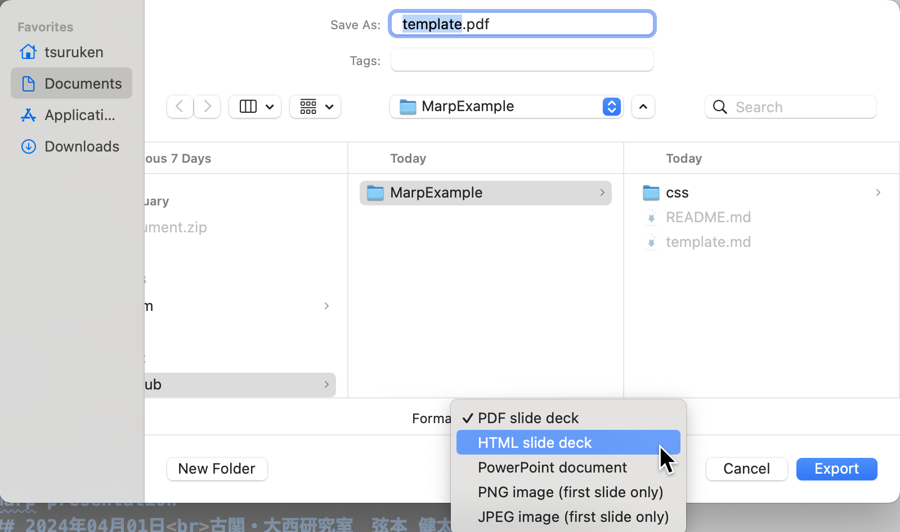

<!--  -->
<!-- 東大公式推奨のフォント
https://fonts.google.com/noto/specimen/Noto+Sans+JP
からダウンロード -->

<!-- Ipeとの互換性をとりたい場合
https://moji.or.jp/ipafont/ipafontdownload/
からダウンロード -->

<!-- 
_paginate: skip 
_class: title 
-->

# Marp Template File:   Introduction to Marp presentation
## 2024年04月01日 東京大学　東大 太郎

___
# 目次

## 1. Basic slide example
## 2. Two column slide
## 3. Slide animation
## 4. Others (Figures, Tables, References)

___
# 1. Basic slide example
## Equations 
Inline math: $a + b = c$, Display math:
$$a + b = c$$

## Items
- Item 1
	- Subitem 1.1
- Item 2

___
# 2. Two column slide
<!-- htmlコマンドを用いるにはsettings.jsonに"markdown.marp.enableHtml": trueを加える必要あり -->

## 1カラム目の内容
1. 内容1
	- 内容1.1
2. 内容2
	- 内容2.1

## 2カラム目の内容
3. 内容3
	- 内容3.1
4. 内容4
	- 内容4.1

___
# 3. Slide animation
1.の代わりに1)を，-の代わりに*を用いることで次のように内容をコマ送りにできる （ただし.htmlに出力した時に限られる，.pdfではまとめて出力される。）

1) アニメーション1
	* アニメーション2
2) アニメーション3
	- アニメーション3
		* アニメーション4

___
# 4. Others (Figures, Tables, References)
*画像の例(caption)*

| Item 1 | Item 2 | Item 3|
| :--- | :---: | ---: |
| 左揃え | 中央揃え | 右揃え |
| 左 | 中央 | 右 |

See official Github page$^{[1]}$ for more cool contents!

> [1] https://github.com/marp-team/marp
